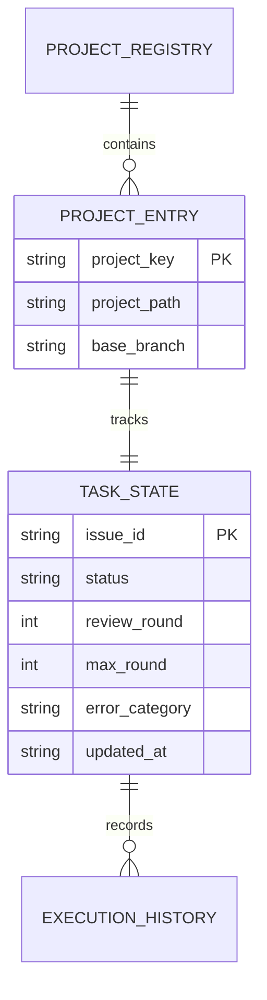

# データ構造・状態設計書（スキーマ・永続化・状態定義）
**[サブタイトル・管理データ構造と永続化仕様]**

| 項目 | 内容 |
| :--- | :--- |
| 文書番号 | [PROJECT_PREFIX]-DS-[NUMBER] （例: SBOS-DS-001） |
| ドキュメント名 | [データ構造仕様書名] |
| 版数 | [Rev.1.0 (新規作成)] |
| 改訂日 | [YYYY-MM-DD] |
| 作成日 | [YYYY-MM-DD] |
| 作成者 | [作成者 / チーム名] |

---

## 1. 概要とデータ管理方針

### 1.1 管理対象データの目的
本設計書が規定するデータ構造、状態定義、JSONスキーマ、メタデータ構成、および永続化方針の目的を明記する。

### 1.2 データ境界 (DAO / 永続化ストレージ正本)
- **データアクセス・永続化正本 (DAO / State)**: 本書はファイルシステムやストレージに物理保存される永続データ・状態タクソノミー・スキーマ構造の正本とする。
- **DTOとの使い分け**: メモリ上のモジュール間パッシング用 DTO については「詳細設計書 (DD)」を参照すること。

### 1.3 ファイル配置および階層構造
システム内で管理されるメタデータ・状態ファイルの配置ディレクトリ階層と命名規則を定義する。

- **母艦メタデータディレクトリ**: 各プロジェクトの定義およびタスク管理データを一括保持する領域
- **状態保存ファイル**: タスクごとの進捗・最終ステータス・試行履歴を保持する正本ファイル
- **排他制御ファイル**: 同時実行・二重起動を防止するためのロックファイル

---

## 2. データ構造およびスキーマ定義 (Mermaid データモデル図)

### 2.1 エンティティ関係・データモデル構造 (Mermaid ER図)
物理保存されるデータ構造の相互関係やスキーマ構造を Mermaid 記法で記述する。

### 2.2 データモデル・フィールド仕様
管理するデータ構造の各フィールド名、データ型、必須性、既定値、および制約条件を明記する。

| フィールド名 | データ型 | 必須性 | デフォルト値 | フィールドの意味・制約条件 |
| :--- | :--- | :---: | :--- | :--- |
| [フィールド名] | [文字列 / 数値 / ブーリアン / 配列 / オブジェクト] | 必須 / 任意 | [既定値] | [役割・取り得る値の範囲・設定ルール] |

---

## 3. 永続化・原子置換契約・排他制御

### 3.1 原子的書き込み契約 (Atomic Write Contract)
データ破損や中途半端な書き込みを防止するためのファイル更新手順を定義する。

1. **一時ファイル生成**: 対象ファイルと同一ディレクトリ内に一時ファイルを作成し、データを全量書き出す
2. **物理書き込み保証**: ディスク同期処理を呼び出し、メモリキャッシュからディスクへの物理的保存を完了させる
3. **原子的置換**: ファイルシステムのアトミック置換処理を用いて、一瞬で正本ファイルを更新する

### 3.2 排他制御仕様 (FileLock)
- **ロック対象ファイル**: 競合を防止する対象のロックファイルパス
- **ロック獲得待ち方針**: ノンブロッキング方式とし、ロック取得失敗時は待機せず即時スキップ処理を行う

---

## 4. データ生命周期と互換性保全

### 4.1 フォーマット移行と互換性ルール
- **旧バージョン互換**: 旧形式のデータ構造を検出した場合の動的変換ルール
- **後方互換性維持**: 新フィールド追加時における未定義キーの安全なフォールバック処理方針

---

## 5. 改訂履歴 (Change Log)

| 版数 | 改訂日 | 変更者 | 変更内容・変更理由 (Why) |
| :--- | :--- | :--- | :--- |
| Rev.1.0 | YYYY-MM-DD | [作成者名] | 新規作成（初版制定） |
