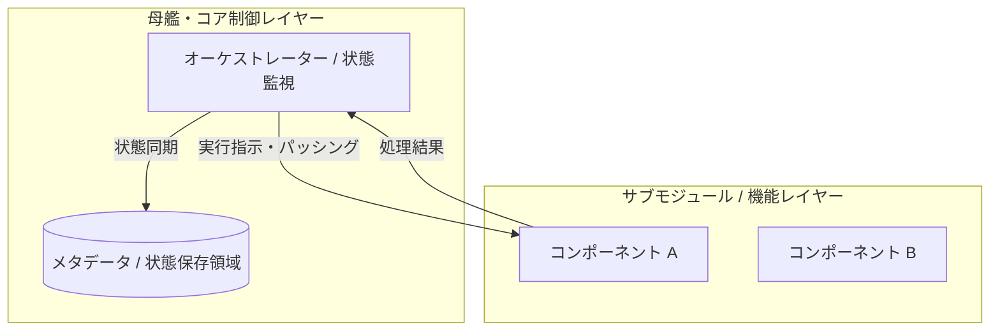

# 基本設計書（基本仕様・システム全体アーキテクチャ定義）
**[サブタイトル・アーキテクチャ概要]**

| 項目 | 内容 |
| :--- | :--- |
| 文書番号 | [PROJECT_PREFIX]-BD-[NUMBER] （例: SBOS-BD-001） |
| ドキュメント名 | [基本設計書名] |
| 版数 | [Rev.1.0 (新規作成)] |
| 改訂日 | [YYYY-MM-DD] |
| 作成日 | [YYYY-MM-DD] |
| 作成者 | [作成者 / チーム名] |

---

## 1. 概要と基本方針

### 1.1 システム目的と対象範囲
本システムおよび対象モジュール群の目的、解決するビジネス・技術的課題、および設計上の基本原則を記述する。

### 1.2 アーキテクチャ基本原則と課題解決
旧実装や従来方式の課題に対し、新構造・採用ツール・構成要素がどのように解決するかを対比して明記する。

| 課題・ボトルネック | 解決方針・選定技術 | 担当コンポーネント |
| :--- | :--- | :--- |
| [従来課題の記述] | [解決策および選定理由] | [担当コンポーネント名] |

---

## 2. システム全体アーキテクチャとコンポーネント分離

### 2.1 全体構造とデータフロー (Mermaid アーキテクチャ図)
システム全体のモジュール配置、呼び出し関係、データおよび制御の流れを Mermaid 記法を用いて記述する。

### 2.2 コンポーネント責務マッピング
各コンポーネントの責務範囲と、関連する詳細設計書名を整理する。

| # | コンポーネント名 | 担当領域・主要責務 | 関連詳細設計書名 |
| :--- | :--- | :--- | :--- |
| 1 | [コンポーネント名] | [担当する具体的な処理・役割の概要] | [対象の詳細設計書名] |

---

## 3. 動作前提およびシステム境界

### 3.1 実行前提環境
- **対応OS**: Windows / Linux / macOS
- **ランタイム要件**: 言語バージョンおよび必須パッケージマネージャー
- **外部依存ツール**: 連携する外部エンジンおよび必須バージョン

### 3.2 安全回路・システム境界方針
- **タイムアウトと再試行制御**: 無限ループ防止のためのリトライ上限設定方針
- **排他制御・競合防止**: 同時実行時の衝突防止メカニズムの方針
- **失敗時保全契約**: 異常終了時におけるデータの非破壊・自動リカバリ原則

---

## 4. 基本設計における変更管理方針
- **拡張時のルール**: 新機能追加時に守るべきレイヤー構造とインターフェース設計原則
- **仕様の決定権 (SSOT)**: 基本設計方針は本書を正本とし、具象シグネチャ・状態遷移は詳細設計書を正本とする旨を明記

---

## 5. 改訂履歴 (Change Log)

| 版数 | 改訂日 | 変更者 | 変更内容・変更理由 (Why) |
| :--- | :--- | :--- | :--- |
| Rev.1.0 | YYYY-MM-DD | [作成者名] | 新規作成（初版制定） |
