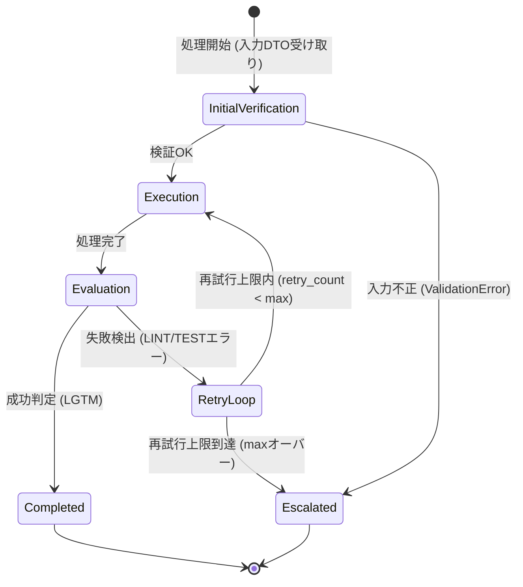
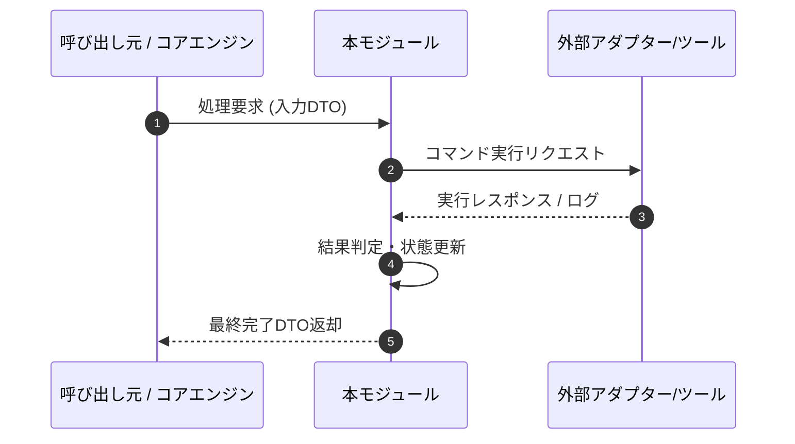

# 詳細設計書（機能・モジュール制御仕様）
**[サブタイトル・担当機能の制御仕様]**

| 項目 | 内容 |
| :--- | :--- |
| 文書番号 | [PROJECT_PREFIX]-DD-[NUMBER] （例: SBOS-DD-001） |
| ドキュメント名 | [詳細設計書名] |
| 版数 | [Rev.1.0 (新規作成)] |
| 改訂日 | [YYYY-MM-DD] |
| 作成日 | [YYYY-MM-DD] |
| 作成者 | [作成者 / チーム名] |

---

## 1. 概要とSSOT境界

### 1.1 モジュールの目的
本モジュールおよび担当機能の詳細ロジック、呼び出し経路、責務範囲を明記する。

### 1.2 単一責任範囲 (SSOT) とデータ境界
- **モジュール制御正本 (SSOT)**: 本書は関数の呼び出し順序、制御フロー、状態遷移ルーティング、エラー対処契約の正本とする。
- **データ境界 (DTO vs DAO)**: 本書はモジュール間・ノード間パッシングで使用される DTO (Data Transfer Object) スキーマを管理する。ファイル永続化・ストレージ構造 (DAO / State正本) については「データ構造仕様書 (DS)」を参照する。

---

## 2. インターフェースと DTO (Data Transfer Object) 仕様

### 2.1 主要関数・機能の役割と契約
モジュール内で提供する主要関数の機能概要、事前条件、事後条件を明記する。

- **対象機能・関数名**: [処理・関数識別名]
- **機能概要**: [実行する具象処理の説明]
- **事前条件 (Pre-conditions)**: [処理実行前に満たされているべき条件・状態]
- **事後条件 (Post-conditions)**: [処理正常終了時に保証される状態・戻り値]

### 2.2 入力 DTO スキーマ・パラメータ仕様
関数の引数・メッセージパケット（DTO）のデータ構造、型、必須性、既定値、バリデーションルールを規定する。

| パラメータ名 / フィールド | データ型 | 必須性 | デフォルト値 | バリデーションルール・入力制約 |
| :--- | :--- | :---: | :--- | :--- |
| [DTOフィールド名] | [データ型] | 必須 / 任意 | [既定値] | [許容フォーマット・文字制限・範囲] |

### 2.3 出力 DTO スキーマ・戻り値仕様
関数の返却データ構造、型、および正常時・異常時の戻り値の内容を定義する。

- **正常時戻り値 DTO**: 返却データの型と格納されるキー・値の意味
- **異常時戻り値 / 例外**: 例外発生時の挙動またはエラー戻り値の仕様

---

## 3. 処理フロー・シーケンス・状態遷移ロジック (Mermaid 図)

### 3.1 処理フロー・シーケンス / 状態遷移図
本モジュールの制御フロー、モジュール間シーケンス対話、または状態遷移を Mermaid 記法を用いて記述する。（※用途に応じて状態遷移図またはシーケンス図を選択・併用すること）

#### A. 状態遷移図サンプル (State Diagram)

#### B. シーケンス図サンプル (Sequence Diagram)

### 3.2 状態遷移およびルーティングルール
状態遷移の判定条件および分岐ロジックをテーブル形式で定義する。

| 現在の状態 / ノード | 実行結果 / 評価フラグ | 次の状態 / ノード | 遷移判定条件・閾値ルール |
| :--- | :--- | :--- | :--- |
| [現在の状態] | [成功 / エラー種別] | [遷移先の状態] | [再試行回数上限や判定フラグの条件] |

---

## 4. エラー処理・失敗契約

### 4.1 エラー分類と対処方針
発生し得るエラーの分類、判定基準、リトライ上限、および最終到達ステータスを明記する。

| エラーカテゴリ | 発生・判定基準 | 再試行上限 | 終端ステータス | 副作用・データ保持契約 |
| :--- | :--- | :---: | :--- | :--- |
| [エラー分類名] | [検出条件・例外種別] | [最大回数] | [最終到達ステータス] | [変更保持 / ロールバック等の副作用] |

---

## 5. テスト・検証要件

### 5.1 単体テスト・品質検証基準
- **テスト対象**: 該当する機能およびモジュール
- **検証項目**: 正常系動作の確認、境界値・異常系例外ハンドリングの通過確認
- **品質ゲート要件**: 静的解析チェックおよび単体テスト全件成功を検証条件とする

---

## 6. 改訂履歴 (Change Log)

| 版数 | 改訂日 | 変更者 | 変更内容・変更理由 (Why) |
| :--- | :--- | :--- | :--- |
| Rev.1.0 | YYYY-MM-DD | [作成者名] | 新規作成（初版制定） |
